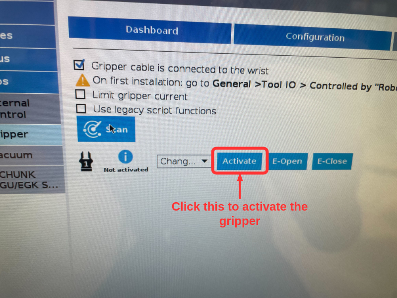
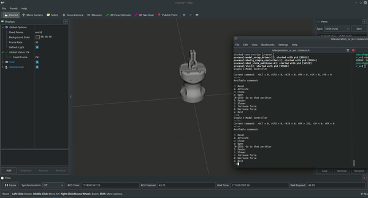

# robotiq_ros_driver

ROS metapackage based on the package developed by the [Control Robotics Intelligence Group](http://www.ntu.edu.sg/home/cuong/) from the [Nanyang Technological University, Singapore](http://www.ntu.edu.sg) and now customised for [Merlin Lab](http://merlin.deib.polimi.it/).

## Setup

  * Robotiq Hand-e (Universal Robots e-series)

## Installation

Go to your ROS working directory. e.g.
```{bash}
cd ~/catkin_ws/src
```

Clone these repository:
```{bash}
git clone https://github.com/MerlinLaboratory/robotiq_ros_driver.git
```

Install any missing dependencies using rosdep:
```{bash}
rosdep update
rosdep install --from-paths . --ignore-src -y
```

Now compile your ROS workspace. e.g.
```{bash}
cd ~/catkin_ws && catkin build
```

## Testing

The repo works with the real gripper only in case the gripper is attacched to the UR5e and the robotiq URcap is installed in the teach pendant. Conversely, the repo can only be simulated in Gazebo.

### Testing in simulation

TODO

### Testing with robot
#### Preliminary steps
Before trying to control the gripper, ensure that you have **activeted the gripper** and set the UR to be **controlled by external entities** (i.e. your computer). In particular to: 

1) **Activete the gripper**: From the *installation* tab in the top left of the UR teach pendant navigate under *Gripper*. After clicking you should see the following:

Press on *Activate* to activate the gripper.

2) **UR controllable from external entities:** on the top right of the UR Teach Pendant it is possible to switch between local/remote control. Please ensure that you set remote as a control mean.

#### 1) Commissioning script
This part can be exploited as a commissioning script to test that the gripper is working as it should. If it is not working correctly, please check [here](#troubleshooting).
It will be now explained the steps to launch the commissioning script:
1) Be sure to always source the appropriate ROS setup file, e.g:
```{bash}
source ~/catkin_ws/devel/setup.bash
```
You might want to add that line to your `~/.bashrc`

2) Physically connect to the ur5e through the ethernet cable and setup a static ip under the robot subnetwork (as of today: `192.168.125.X`)

3) Try launching the exaple script `urcap_cmodel_test` changing the *ur_robot_ip* with the actual ip of the robot:
```{bash}
roslaunch robotiq_control urcap_cmodel_test.launch address:=ur_robot_ip 
roslaunch robotiq_control urcap_cmodel_test.launch address:=192.168.125.121 # For Merlin Lab
```
The gripper can be controlled with the following commands:
```
Simple C-Model Controller
-----
Current command:  rACT = 0, rGTO = 0, rATR = 0, rPR = 0, rSP = 0, rFR = 0
-----
Available commands

r: Reset
a: Activate
c: Close
o: Open
(0-255): Go to that position
f: Faster
l: Slower
i: Increase force
d: Decrease force
-->
```
Hereafter a video of what you should visualise in Rviz:

the real gripper should move accordigly to the Rviz visulisation.

#### 2) Production Script
This part explains how the gripper can be commanded without using a simple dashboard as the previous one. In particular, the following scripts will make available the following services that let an external user interact with the gripper from other ROS nodes:

```{bash}
rosservice call /hande/open_gripper 
rosservice call /hande/close_gripper
```

Despite you could set the gripper velocity and force, these services does not take any argument. Therefore, velocity and force can be set from the [config](robotiq_control/config/gripper_params.yaml). However, it is still possible to use the following service to control the gripper position, velocity and force:

```{bash}
Service is still not available :) -> Code it yourself :))))
```

### Troubleshooting
#### The gripper does not move when issuing close/opening
Before asking to the gripper to open/close it is necessary to activate the gripper from the robot teach pendant. Please ensure that you have followed the preliminary steps.